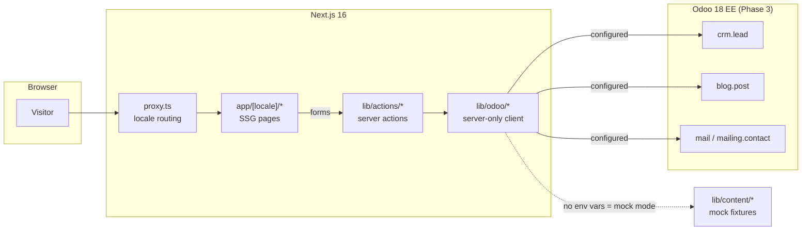

<div align="center">

# LionGate Sarl — Corporate Website

**Big and Global, Go Digital**

Bilingual (FR/EN) corporate website for LionGate Sarl — a Douala-based company operating two poles:
**IT & Software Outsourcing** and **Cosmetics Distribution** — built as a decoupled Next.js frontend
with **Odoo 18 EE as the headless backend** for CRM leads, blog content, and newsletter.

[](https://nextjs.org)
[](https://react.dev)
[](https://www.typescriptlang.org)
[](https://tailwindcss.com)
[](https://playwright.dev)
[](https://www.conventionalcommits.org)

</div>

---

## Table of Contents

- [Quick Start](#quick-start)
- [Scripts](#scripts)
- [Tech Stack](#tech-stack)
- [Architecture](#architecture)
- [Project Structure](#project-structure)
- [Design System](#design-system)
- [Internationalization](#internationalization)
- [Forms & Server Actions](#forms--server-actions)
- [Testing & Quality Gates](#testing--quality-gates)
- [Environment Variables](#environment-variables)
- [Mandatory Development Rules](#mandatory-development-rules)
- [Roadmap](#roadmap)
- [Known Placeholders](#known-placeholders)

---

## Quick Start

**Prerequisites:** Node `^22` (see `.nvmrc`) and pnpm `10` (pinned via `packageManager`).

```bash
pnpm install
pnpm dev
```

Optionally create a `.env.local` with the variables listed under
[Environment Variables](#environment-variables) — all of them are optional.

Open [http://localhost:3000](http://localhost:3000) — it redirects to `/fr` (or `/en` for
English-preferring browsers).

> **No Odoo credentials? No problem.** With an empty `.env.local` the site runs in **mock mode**:
> blog posts, references, and vacancies come from local fixtures, and form submissions resolve
> against simulated actions. The full site is demoable with zero configuration.

> ⚠️ **This is Next.js 16 — not the Next.js you may know.** Conventions differ from older
> versions (e.g. `src/proxy.ts` replaces `middleware.ts`). Before implementing any framework
> feature, read the relevant guide in `node_modules/next/dist/docs/`.

## Scripts

| Command           | What it does                                              |
| ----------------- | --------------------------------------------------------- |
| `pnpm dev`        | Start the dev server on `localhost:3000`                  |
| `pnpm build`      | Production build (all routes prerender as SSG)            |
| `pnpm start`      | Serve the production build                                |
| `pnpm typecheck`  | `tsc --noEmit` with strict settings                       |
| `pnpm lint`       | ESLint (includes the no-comments and jsx-a11y rules)      |
| `pnpm test`       | Vitest unit tests (utils, read-time, i18n parity, motion) |
| `pnpm test:watch` | Vitest in watch mode                                      |
| `pnpm test:e2e`   | Playwright suite (smoke, forms, keyboard a11y)            |
| `pnpm format`     | Prettier (with Tailwind class sorting) on the whole repo  |

Git hooks (installed automatically via `pnpm install`): **pre-commit** runs lint-staged
(Prettier + ESLint on staged files), **commit-msg** enforces
[Conventional Commits](https://www.conventionalcommits.org) via commitlint.

## Tech Stack

| Layer           | Choice                                        | Why                                                                 |
| --------------- | --------------------------------------------- | ------------------------------------------------------------------- |
| Framework       | **Next.js 16** (App Router, `src/` layout)    | SSG for all marketing pages, ISR-ready for the Odoo blog            |
| UI              | **React 19**, Server Components by default    | `"use client"` only on interactive/motion leaves                    |
| Styling         | **Tailwind CSS v4**                           | All design tokens live in the `@theme` block of `globals.css`       |
| Motion          | **motion** (`motion/react`)                   | Scroll reveals, parallax, scroll-progress — all reduced-motion safe |
| i18n            | **next-intl**                                 | `/fr` (default) + `/en` routing via `src/proxy.ts`                  |
| Forms           | **react-hook-form + zod**                     | One schema shared between client validation and the server action   |
| Env validation  | **@t3-oss/env-nextjs**                        | Malformed env vars fail the build; absent ones switch to mock mode  |
| Backend (Ph. 3) | **Odoo 18 EE** (headless)                     | CRM leads, blog content, `mailing.contact` newsletter               |
| Quality         | ESLint 9 + Prettier + Trunk + husky           | Meta-linting, security scanners, hook-enforced standards            |
| Tests           | **Vitest** + Testing Library + **Playwright** | Unit + component + e2e against the production build                 |

## Architecture



Three rules make this safe:

1. **The browser never talks to Odoo.** Everything relays through Next.js server code with zod
   validation, honeypot checks, and (Phase 3) rate limiting.
2. **`lib/odoo` imports `server-only`** — credentials cannot leak into a client bundle,
   enforced at compile time.
3. **Mock mode is transparent.** Consumers call `getPosts()` / `createLead()` and never know
   which backend answered — absent env vars route every call to local fixtures.

## Project Structure

```text
web-app/
├── messages/                  # ALL site copy — fr.json + en.json (key parity is unit-tested)
├── public/images/             # Local imagery (placeholder photography, see below)
├── e2e/                       # Playwright: smoke, forms, keyboard a11y
└── src/
    ├── proxy.ts               # next-intl locale routing (Next 16: replaces middleware.ts)
    ├── app/
    │   ├── globals.css        # @theme design tokens — THE single source of visual truth
    │   ├── fonts.ts           # Self-hosted: Anton, Bebas Neue, IBM Plex Sans/Mono
    │   └── [locale]/          # Thin routes: metadata + section composition only
    ├── components/
    │   ├── ui/                # Primitives (button, input, dialog, sheet, accordion…)
    │   ├── layout/            # Navbar, footer, section, cookie banner, locale switcher
    │   ├── motion/            # Reveal, StaggerText, Parallax, ScrollFade, ScrollProgress
    │   └── sections/<page>/   # Page markup, one folder per page
    ├── lib/
    │   ├── actions/           # Server actions + shared zod schemas
    │   ├── content/           # Mock data + read-time estimation (Odoo replaces in Phase 3)
    │   ├── odoo/              # Server-only Odoo client (Phase 3)
    │   └── env.ts             # t3-env schema — build fails on malformed vars
    ├── config/                # site.ts (identity), nav.ts (single nav model)
    ├── i18n/                  # next-intl routing + request config
    └── types/                 # Content models, lead payloads, message-key typing
```

**Layering is one-way:** `app → components → lib`. `lib` never imports from `components`;
`components/ui` never imports from `sections`. Every new file goes in its designated layer —
no parallel locations.

## Design System

The visual identity follows the official LionGate charter, executed in a
reference-led premium editorial direction (dark-dominant with deliberate light bands,
gold as the single accent).

- **Tokens only.** Every color, size, radius, and easing is a CSS variable in the `@theme`
  block of [`src/app/globals.css`](src/app/globals.css). Raw hex/px literals in components are
  banned and rejected in review.
- **Surfaces.** Three surface utilities — `surface-dark`, `surface-light`, `surface-bordeaux` —
  reassign the semantic aliases (`--color-foreground`, `--color-body-text`, `--color-muted`,
  `--color-border`, `--color-accent`), so any component is automatically WCAG 2.2 AA on
  whichever band it sits on. Every text/surface pair is contrast-verified (most are AAA).
- **Type stack** (all OFL-licensed, self-hosted woff2 via `next/font/local`):
  Anton (mega display), Bebas Neue (headings, uppercase), IBM Plex Sans (body — the only
  mixed-case text), IBM Plex Mono (nav, labels, buttons, tags).
- **Motion.** Signature easing `cubic-bezier(0.16, 1, 0.3, 1)` everywhere. Scroll reveals,
  hero parallax, and a blog reading-progress bar — every animation collapses to static under
  `prefers-reduced-motion`.
- **Living styleguide** at [`/fr/styleguide`](http://localhost:3000/fr/styleguide) (noindexed):
  tokens, surfaces, type scale, primitives, imagery treatments, and motion demos.

## Internationalization

- French is the default locale; English is negotiated from the browser (`/` → `/fr` or `/en`).
- **Every string lives in `messages/fr.json` + `messages/en.json`** — including image alt text
  and validation errors. Hardcoded copy in JSX is a review-blocker.
- Message keys are **typed**: an unknown key fails `pnpm typecheck` (next-intl `AppConfig`
  augmentation in `src/types/i18n.ts`).
- A unit test asserts both catalogs have identical key sets — a `fr` string cannot ship
  without its `en` sibling.

## Forms & Server Actions

Contact (pole-routed, quote intent), careers application, and newsletter subscription all
follow the same pattern:

```text
zod schema (lib/actions/schemas.ts)
  ├── client: react-hook-form + zodResolver → localized field errors
  └── server: action re-validates the same schema → honeypot check → backend call
```

- Error messages are **message keys**, resolved per locale at render time.
- Honeypot fields trigger a silent fake-success — bots learn nothing.
- Deep links pre-fill the form: `/contact?pole=it&intent=quote` (used by the IT pole's
  "Demander un devis" CTA; the intent becomes a dedicated CRM tag in Phase 3).
- Actions are stubs today (simulated latency, typed results) and swap to Odoo CRM /
  `mailing.contact` in Phase 3 behind the same signatures.

## Testing & Quality Gates

| Gate        | Scope                                                                                                             |
| ----------- | ----------------------------------------------------------------------------------------------------------------- |
| `typecheck` | Strict TS, `noUncheckedIndexedAccess`, typed message keys                                                         |
| `lint`      | ESLint 9 flat config: **no-comments rule**, `no-explicit-any`, jsx-a11y                                           |
| `test`      | Vitest: `cn()`, read-time estimation, **fr/en key parity**, reduced-motion                                        |
| `test:e2e`  | Playwright vs the production build: locale routing, 404s, forms (validation, success, honeypot), keyboard a11y    |
| CI          | GitHub Actions: typecheck → lint → unit → build → e2e, plus a Lighthouse job (non-blocking until Phase 4 budgets) |
| Trunk       | Meta-linting + security scanners (trufflehog, osv-scanner, checkov)                                               |

All gates must be green before merge. `main` is protected — PRs only.

## Environment Variables

Set in `.env.local` (never committed). All are optional — absence enables mock mode.

| Variable                     | Purpose                                                                                  |
| ---------------------------- | ---------------------------------------------------------------------------------------- |
| `ODOO_URL`                   | Odoo 18 instance URL (must be a valid URL)                                               |
| `ODOO_DB`                    | Odoo database name                                                                       |
| `ODOO_USERNAME`              | Technical user (least privilege: `crm.lead`, `blog.post`, `blog.tag`, `mailing.contact`) |
| `ODOO_PASSWORD`              | Technical user API key                                                                   |
| `ODOO_CRM_TEAM_IT_ID`        | Sales team id for IT-pole leads                                                          |
| `ODOO_CRM_TEAM_COSMETICS_ID` | Sales team id for Cosmetics-pole leads                                                   |
| `REVALIDATE_SECRET`          | Shared secret for the blog revalidation webhook                                          |

Validation happens at build time via `src/lib/env.ts` — a malformed value fails the build
loudly; a missing one is fine (mock mode).

## Mandatory Development Rules

These are obligatory in every part of development:

1. **No comments in code.** Code must explain itself — better names, smaller functions,
   extracted variables. Enforced by a custom ESLint rule.
2. **Developer experience first.** Anybody should understand the code on first read.
3. **Best practices always** — strict typing, single responsibility, shared validation,
   accessible and performant output.
4. **Stick to the folder structure** shown above. Every file goes in its designated layer;
   never invent parallel locations.
5. **Tokens only** — no raw style values in components.
6. **Both locales together** — no `fr` string without its `en` sibling.

## Roadmap

| Phase | Deliverable                                                            | Status                                     |
| ----- | ---------------------------------------------------------------------- | ------------------------------------------ |
| 0     | Foundation: tokens, fonts, i18n, env validation, tooling, CI           | ✅ Done (logo assets pending from company) |
| 1     | Design system: primitives, motion, chrome, styleguide                  | ✅ Done                                    |
| 2     | All pages with real FR/EN copy on mock data                            | ✅ Done                                    |
| —     | Reference-led visual redesign (RiseAlliance/Cedar direction)           | ✅ Done                                    |
| 3     | Odoo 18 integration: blog ISR + webhook, CRM leads, emails, newsletter | ⏳ Next                                    |
| 4     | SEO, JSON-LD, OG images, analytics, performance budgets (blocking)     | ⬜                                         |
| 5     | Launch QA: full e2e, a11y audit, content review, deploy, runbook       | ⬜                                         |

## Known Placeholders

Pending assets from the company — everything is wired so swapping them is a file drop:

- **Photography**: all images in `public/images/` are warm-graded stock placeholders.
  Replace with real LionGate/Douala photography (~2000px wide) and update the paths in
  `src/lib/content/*` and the section components. The cosmetics imagery currently shows
  third-party branded products and must be replaced before launch.
- **Logo**: the official blason (black-background version + shield-and-"L" icon for the
  favicon) goes in `public/brand/` once provided.
- **Contact details**: the phone number in `src/config/site.ts` is a placeholder.
- **Legal pages**: privacy/terms drafts need review by the company before launch.

---

<div align="center">

**LionGate Sarl** · Douala, Cameroun · _Big and Global, Go Digital_

</div>
